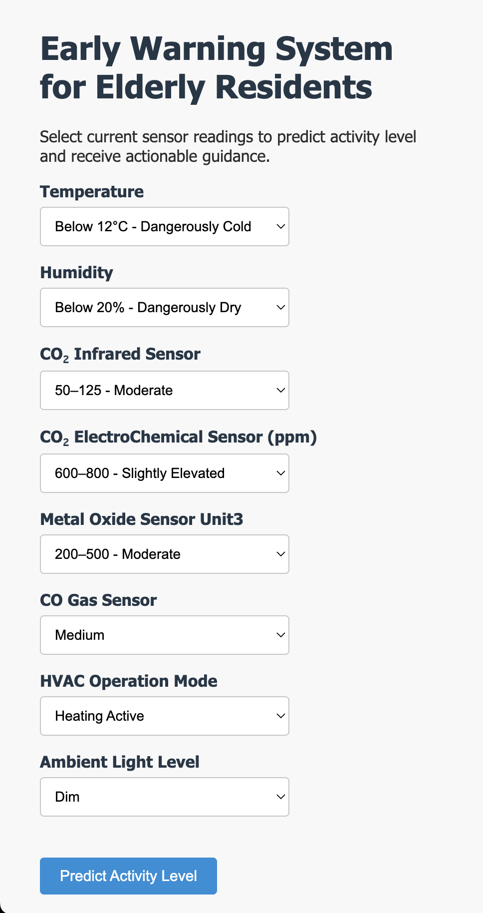
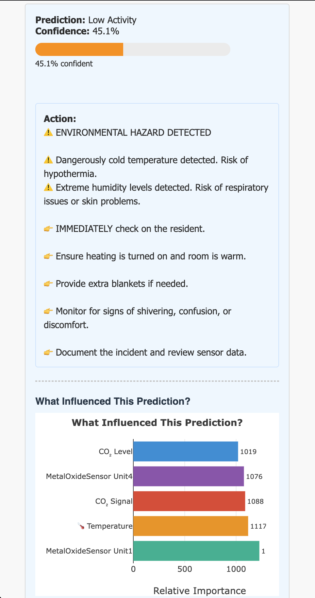
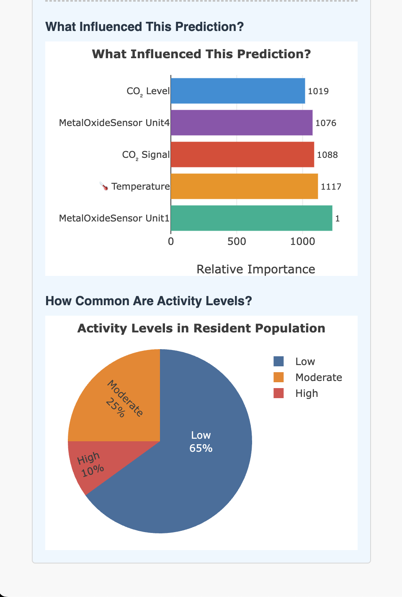

# EARLY WARNING SYSTEM FOR ELDERLY RESIDENTS

**Full Name:** Rodrigues Noel Mark  
**NRIC:** 991H  
**Email:** noel.mr@gmail.com

[](https://web-production-a1c35.up.railway.app)  
[](https://github.com/rodriguesnoel/elderly-early-warning-system)


## **1. PROJECT OVERVIEW**

This project develops a non-invasive early warning system that predicts the activity level of elderly residents using environmental sensor data from smart homes. By analysing patterns in temperature, humidity, gas levels, lighting, and HVAC usage, the system detects potential health emergencies or concerning situations such as sudden high activity or prolonged inactivity.

The solution combines machine learning with user-friendly design to support proactive care coordination while respecting privacy and minimiSing false alarms.


## **2. KEY FEATURES**

### Real-time Prediction
- Predicts resident activity level (Low, Moderate, High) based on current sensor readings
- Provides confidence scores for each prediction

### Actionable Guidance
- Contextual recommendations based on both prediction and environmental risks
- Clear instructions for caregivers with priority actions
- Immediate alerts for environmental hazards (e.g., dangerously cold temperatures)

### Interactive Visualizations
- **Feature Importance Chart**: Shows which sensors most influenced the prediction
- **Class Distribution Pie Chart**: Displays typical activity patterns across residents

  
*User-friendly form with descriptive dropdowns for easy input*

  
*Clear action guidance and feature importance visualization*

  
*Interactive charts showing what influenced the prediction and common activity levels*


## **3. FOLDER STRUCTURE**

- data/
    - gas_monitoring.db
- src/
    - __init_py
    - data_loader.py
    - preprocessing.py
    - feature_engineer.py
    - model_trainer.py
    - model_evaluator.py
- eda.ipynb
- requirements.txt
- run.sh
- README.md
- artifacts/
    - feature_importance.json
    - label_encoder.pkl
    - model_features.pkl
    - model.pkl
- Procfile
- Dockerfile
- templates/
    - index.html
- static/
    - css/
      - styles.css
    - js/
      - app.js
- train_pipelines.py
- app.py
- images/
    - screenshot01.png
    - screenshot02.png
    - screenshot03.png

## **4. PIPELINE FLOW**

The pipeline consists of the following modular steps:

**i) Data Loading** (`src/data_loader.py`):
   - Fetches data from the SQLite database (`data/gas_monitoring.db`).

**ii) Preprocessing** (`src/preprocessing.py`):
   - Handles missing values, clips outliers, and ensures data quality.

**iii) Feature Engineering** (`src/feature_engineer.py`):
   - Encodes categorical variables (e.g., one-hot encoding for nominal features, ordinal encoding for ordered categories).
   - Creates numerical representations suitable for modeling.

**iv) Model Training** (`src/model_trainer.py`):
   - Trains three models: Logistic Regression, Random Forest, and LightGBM.
   - Implements class weighting to handle imbalanced classes.

**v) Model Evaluation** (`src/model_evaluator.py`):
   - Evaluates models using macro F1-score, precision, recall, and confusion matrices.
   - Identifies key features contributing to predictions.

This modular design ensures the pipeline is reusable, readable, and easy to modify for future experiments.


## **5. KEY EDA FINDINGS & THEIR IMPACT ON THE PIPELINE**

### Dataset Overview
- 10,000 rows, 14 features (mix of numerical and categorical). Contains sensor readings such as:
    - Temperature
    - Humidity
    - CO₂ levels
    - Metal oxide sensor readings
    - HVAC operation modes
    - Ambient light levels
    - Activity classifications
- Target variable: `Activity Level` with classes: `Low Activity`, `Moderate Activity`, `High Activity`

### Major Findings
- **Class Imbalance**:  
  `Low Activity` (58.0%) dominates, while `High Activity` (10.9%) is rare — critical for detecting emergencies.  
  → Addressed using `class_weight='balanced'` in all models.

- **Out-of-Range Values Detected**:  
  - Temperature: up to 298°C (impossible indoors)  
  - Humidity: negative values and >199%  
  - CO₂ readings: below 400 ppm or negative  
  → Assumed sensor errors; fixed by **clipping** to valid ranges.

- **Missing Values**:  
  - `MetalOxideSensor_Unit3`: 25.7% missing, clustered by Session ID → likely MNAR  
  - `Ambient Light Level`: 25.3% missing, fairly uniform → likely MAR  
  - `CO_GasSensor`: 13.7% missing  
  → Handled by:  
    - Adding `'unknown'` category for categorical features  
    - Using median imputation + missing indicator for numerical (`MetalOxideSensor_Unit3_was_missing`)

- **Categorical Inconsistencies**:  
  - `HVAC Operation Mode` had 20+ variants due to casing/syntax (e.g., `Heating_active`, `HEATING_ACTIVE`)  
  - `Activity Level` had malformed labels like `LowActivity`, `ModerateActivity`  
  → Cleaned and standardized in `preprocessing.py`

- **CO₂_InfraredSensor Not in ppm**:  
  Values range from -15 to 236 — far below typical 400–2000 ppm indoor levels  
  → Treated as a **raw signal** (unitless), not absolute concentration  
  → Used as-is after clipping to [0, 250]

These findings directly informed our preprocessing and modeling decisions, ensuring robustness and real-world applicability.


## **6. FEATURE PROCESSING SUMMARY**

The following table summarizes how each feature was processed in the pipeline based on EDA findings.

| Feature | Type | Missing Values | Outliers | Processing Method | Rationale |
|--------|------|----------------|----------|-------------------|-----------|
| Temperature | Numerical | None | Yes (e.g., 298°C) | Clipped to [12, 40]°C | Values outside this range are implausible for indoor environments |
| Humidity | Numerical | Yes (503 entries) | Yes (negative, >199%) | Clipped to [20, 80]% | Negative or extreme humidity not physically plausible |
| CO₂_InfraredSensor | Numerical | None | Yes (values < 0) | Clipped to [0, 250] | Sensor outputs raw signal, not ppm; negative values invalid |
| CO₂_ElectroChemicalSensor | Numerical | 706 entries | Yes (values < 400 ppm) | Clipped to [400, 2000] ppm, then median imputed | Below 400 ppm is implausible; imputation preserves sample size |
| MetalOxideSensor_Unit3 | Numerical | 2,566 entries (25.7%) | No | Median imputed + `was_missing` indicator | Missingness is MNAR (clustered by Session ID); indicator preserves signal |
| CO_GasSensor | Categorical | 1,369 entries | No | Cleaned, converted to ordered categorical, filled with `'unknown'` | Maintains ordinality; missingness may be informative |
| HVAC Operation Mode | Categorical | None | No | Standardized to lowercase, space-separated, then one-hot encoded | Removes formatting noise; one-hot avoids false ordering |
| Ambient Light Level | Categorical | 2,532 entries (25.3%) | No | Cleaned, then filled with `'unknown'`, one-hot encoded | Treats missing as potential signal; encoding preserves nominal nature |
| Activity Level | Categorical (Target) | None | No | Mapped to standard labels: `Low Activity`, `Moderate Activity`, `High Activity` | Fixes inconsistent formatting for reliable modeling |
| Session ID | Identifier | None | No | Dropped | Not predictive; used only for grouping during EDA |
| Time of Day | Categorical | None | No | Dropped | Not used in final model to avoid overfitting to time patterns |


## **7. MODEL CHOICE & EXPLANATION**

Three classification models were selected based on their suitability for this imbalanced, mixed-feature dataset and the need for both performance and interpretability in a healthcare context.

### i) Logistic Regression
- **Why chosen**: Serves as a simple, interpretable baseline.
- **Advantages**: Coefficients can be analyzed to understand feature influence — useful for explaining alerts to caregivers.
- **Handling imbalance**: Uses `class_weight='balanced'` to give higher penalty to misclassifying minority classes (e.g., `High Activity`).

### ii) Random Forest Classifier
- **Why chosen**: Robust to outliers, handles non-linear relationships, and works well with mixed numerical and categorical features.
- **Advantages**: 
  - Naturally handles feature interactions (e.g., high CO₂ + low light may indicate inactivity).
  - Provides feature importance scores.
  - Less prone to overfitting due to bagging.

### iii) LightGBM
- **Why chosen**: High-performance gradient boosting model that excels in accuracy and speed.
- **Advantages**:
  - Handles large datasets efficiently.
  - Built-in support for categorical features.
  - Sequential error correction improves detection of rare events like `High Activity`.
  - Provides feature importance for explainability.

All models use `class_weight='balanced'` to address the class imbalance, ensuring that the minority class (`High Activity`) is not overlooked during training.


## **8. MODEL EVALUATION & METRICS**

All models were evaluated using the following metrics to ensure robust performance, especially on the minority class (`High Activity`):

### Evaluation Metrics
- **Macro F1-Score**: Chosen as the primary metric because it gives equal weight to all classes, regardless of size. This is critical for detecting `High Activity` events, which are rare (10.9%) but clinically significant.
- **Precision (macro)**: Measures the proportion of correct positive predictions across all classes. High precision reduces false alarms.
- **Recall (macro)**: Measures the proportion of actual positives correctly identified. High recall ensures we don’t miss true emergencies.
- **Confusion Matrix**: Visualizes where models confuse classes (e.g., predicting `Moderate Activity` when it’s actually `High Activity`).

### Why Macro-Averaging?
Using **macro** instead of **weighted** or **micro** averaging ensures that the minority class (`High Activity`) is not overshadowed by the majority class (`Low Activity`). In a healthcare context, missing a high-activity event could be dangerous — so we prioritize balanced performance.

### Expected Output
When running `model_evaluator.py`, you’ll see:
- Classification reports for each model
- Confusion matrices (visualized)
- Final comparison of macro F1-scores
- Identification of the best-performing model

This evaluation strategy ensures the selected model is both accurate and reliable for real-world deployment.


## **9. OTHER CONSIDERATIONS FOR DEPLOYMENT**

When deploying this early warning system in real-world settings, several critical factors must be considered to ensure safety, usability, and trust.

### i) Privacy by Design
- The model uses only environmental and sensor data — no cameras, audio, or personal health records.
- No personally identifiable information (PII) is stored or processed beyond `Session ID`, which is anonymised.
- Aligns with non-invasive monitoring principles for elderly care.

### ii) False Alarms
- Over-alerting can lead to caregiver fatigue and reduced trust in the system.
- To minimise false positives:
  - Models are evaluated using **macro F1-score**, ensuring balanced performance across all classes.
  - Predictions can be smoothed over time (e.g., trigger alert only if `High Activity` is predicted for 2+ consecutive windows).
  - Confidence thresholds can be applied (e.g., only act if prediction probability > 80%).

### iii) Time-Based Patterns
- Daily routines (e.g., sleeping late, nighttime bathroom visits) vary by individual.
- Although `Time of Day` was dropped from the model to avoid overfitting, future versions could incorporate **personalised baselines** per resident using time-aware models or clustering.

### iv) Explainability
- Caregivers need to understand *why* an alert was triggered.
- Feature importance (from Random Forest or LightGBM) provides interpretable insights (e.g., “High activity predicted due to elevated temperature and CO₂ levels”).
- This supports transparency and builds trust in automated alerts.

### v) Generalisation Across Individuals
- The current model assumes a **generalised behavior pattern**.
- In practice, one resident’s “normal” (e.g., low light use, infrequent HVAC use) may resemble another’s “abnormal.”
- Future improvements could include **resident-specific models** trained on individual data to capture personal habits.

### vi) Model Monitoring and Retraining
- Sensor drift or changes in resident behavior may degrade model performance over time.
- Implement periodic retraining with new data and monitor prediction drift to maintain accuracy.

These considerations ensure that the model not only performs well technically but also aligns with ethical, practical, and operational requirements for deployment in elderly care environments.


## **10. RESULTS**

The three models were evaluated using **macro F1-score**, which gives equal weight to all classes — critical for detecting rare but important events like `High Activity`.

### Model Performance (Macro F1-Score)
| Model | Macro F1-Score | Precision (High) | Recall (High) |
|------|----------------|------------------|---------------|
| Logistic Regression | 0.423 | 0.000 | 0.000 |
| Random Forest | 0.538 | 0.641 | 0.115 |
| LightGBM | **0.562** | 0.274 | 0.431 |

✅ **Best Model**: **LightGBM** achieved the highest macro F1-score (0.562), with the best balance between precision and recall for the `High Activity` class.

While Random Forest had higher precision for `High Activity`, LightGBM detected **43.1% of high-activity events** (recall = 0.431), nearly 4× better than Random Forest (11.5%) and infinitely better than Logistic Regression (0%).

This makes LightGBM the most suitable model for deployment in an early warning system, where **missing fewer critical events** is paramount.

### Key Observations
- **Logistic Regression failed** to detect `High Activity` (F1 = 0.0) — likely due to non-linear relationships in the data.
- **Random Forest** was overly conservative, producing many false negatives.
- **LightGBM** leveraged boosting to correct errors and better capture patterns in sensor data.


## **11. Deployment & Security**

### Privacy by Design
- Uses only environmental sensor data (temperature, humidity, CO₂, etc.)
- No cameras, audio, or personal health records collected
- All data processed locally or securely on server

### Production Environment
- Deployed on Railway with Docker containerization
- Uses `gunicorn` WSGI server for production stability
- Includes proper error handling and logging


## **12. HOW TO RUN PIPELINE**

The pipeline is automated via a bash script and can be executed end-to-end with a single command.

### Prerequisites
- Python 3.8 or higher
- SQLite3
- The `gas_monitoring.db` file placed in the `data/` folder

### Step-by-Step Instructions

**i) Clone the repository**
   ```bash
   git clone https://github.com/rodriguesnoel/elderly-early-warning-system.git
  cd elderly-early-warning-system
```      
**ii) Install dependencies**
   ```bash
    pip install -r requirements.txt
```
**iii) Run the full pipeline**
   ```bash
    python app.py
```


## **13. DEPENDENCIES**

All required Python packages are listed in `requirements.txt`:
```
pandas>=1.5.0
numpy>=1.21.0
scikit-learn>=1.3.0
lightgbm>=3.3.0
matplotlib>=3.7.0
seaborn>=0.12.0
sqlalchemy>=2.0.0
jupyter>=1.0.0
```

These packages support:
- Data loading and manipulation (pandas, sqlalchemy)
- Preprocessing and modeling (numpy, scikit-learn, lightgbm)
- Visualisation (matplotlib, seaborn)
- Notebook development (jupyter)